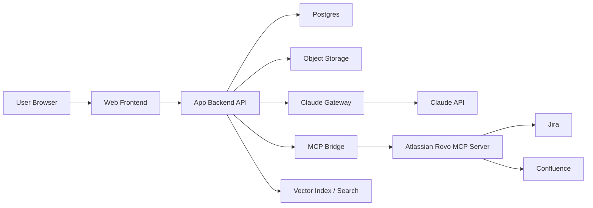

# PRD: Claude-Like AI Workspace Web App

Tanggal: 2026-06-03
Status: Draft v1
Target: Web app percakapan AI berbasis Claude API dengan project workspace, memory, integrasi Atlassian, Skills, upload file, dan output Markdown.

## 1. Ringkasan Produk

Produk ini adalah web app percakapan AI ala Claude App untuk tim yang ingin bekerja dengan konteks jangka panjang. Aplikasi menyediakan chat AI berbasis Claude API, pengelompokan percakapan ke dalam Project, memory global dan memory per project, upload file, penggunaan Claude Skills, tool calling ke Jira dan Confluence melalui Atlassian Rovo MCP Server dengan OAuth user Atlassian, serta kemampuan menghasilkan dan menyimpan file `.md`.

Produk bukan sekadar chat UI. Nilai utamanya adalah persistent work context: setiap project punya instruksi, memory, file, skill, session history, dan koneksi tool yang dapat dipakai berulang tanpa pengguna harus mengulang konteks dari nol.

## 2. Tujuan

1. Membuat pengalaman chat AI yang familiar seperti Claude App, tetapi dapat dikontrol penuh oleh produk sendiri.
2. Menyediakan Project sebagai ruang kerja terisolasi untuk konteks, file, memory, skill, dan session.
3. Mengaktifkan memory global dan memory project agar AI dapat mengingat preferensi, keputusan, istilah, dan konteks kerja penting.
4. Menghubungkan AI ke Jira dan Confluence melalui MCP Server Rovo dengan OAuth Atlassian per user.
5. Mendukung upload file dan pemakaian file sebagai konteks percakapan.
6. Mendukung Claude Skills untuk workflow khusus, termasuk skill custom.
7. Memungkinkan AI menghasilkan file Markdown yang dapat disimpan, diunduh, diedit, dan dipakai ulang sebagai konteks.

## 3. Non-Goals

1. Tidak membuat clone visual 1:1 dari Claude App.
2. Tidak menyimpan atau menggunakan token Atlassian lintas user.
3. Tidak memberi AI akses otomatis ke Jira/Confluence tanpa consent dan permission user.
4. Tidak menjadikan memory sebagai sumber kebenaran mutlak tanpa review atau audit trail.
5. Tidak membangun semua tool Atlassian manual via REST API pada MVP jika Rovo MCP sudah cukup untuk read/create/update dasar.

## 4. Persona

### 4.1 Product/Engineering Lead

Butuh AI yang memahami project, bisa membaca Confluence, membuat Jira issue, dan membantu menyusun dokumen teknis.

### 4.2 Developer

Butuh workspace AI untuk diskusi kode, upload file, generate dokumen `.md`, dan melanjutkan session lama.

### 4.3 PM/Operations

Butuh AI untuk merangkum meeting note, membuat backlog Jira, memperbarui Confluence, dan menyimpan konteks keputusan project.

## 5. User Journey Utama

1. User login ke web app.
2. User membuat Project baru.
3. User menambahkan instruksi project, memory project, dan file pendukung.
4. User menghubungkan akun Atlassian melalui OAuth.
5. User memulai chat dalam project.
6. AI menjawab dengan konteks project, memory, file, dan skill yang relevan.
7. Saat butuh data Jira/Confluence, AI meminta atau menjalankan tool MCP sesuai policy.
8. User dapat melihat tool call, hasil tool, dan menyetujui aksi berdampak tinggi.
9. User meminta AI membuat dokumen `.md`.
10. Dokumen tersimpan sebagai generated artifact dan dapat diunduh atau dijadikan konteks session berikutnya.
11. User dapat fetch/resume session lama dari daftar session project.

## 6. Scope MVP

### 6.1 Chat Workspace

- Chat interface dengan streaming response.
- Sidebar daftar project dan session.
- Session title otomatis dari percakapan pertama.
- Resume session lama.
- Stop generation.
- Regenerate response.
- Copy response.
- Export response atau artifact ke `.md`.

### 6.2 Projects

- Create, rename, archive, delete project.
- Project instruction/system prompt.
- Project file library.
- Project memory.
- Project session list.
- Project skill configuration.
- Project tool connection status.

### 6.3 Memory

- Global memory: berlaku lintas project untuk preferensi user yang stabil.
- Project memory: berlaku hanya dalam project tertentu.
- Memory item memiliki tipe:
  - preference
  - fact
  - decision
  - terminology
  - workflow
  - constraint
- User dapat create, edit, delete, disable, dan pin memory.
- AI dapat mengusulkan memory baru, tetapi user harus approve sebelum memory aktif.
- Memory injection ke prompt harus transparan dan tercatat.

### 6.4 Fetch Session

- API untuk mengambil daftar session berdasarkan user dan project.
- API untuk mengambil detail session lengkap:
  - messages
  - attached files
  - tool calls
  - generated artifacts
  - memory references
  - token/cost metadata
- Session dapat dilanjutkan tanpa kehilangan konteks penting.
- Session dapat difilter berdasarkan project, tanggal, tag, dan keyword.

### 6.5 Claude API Integration

- Backend menyediakan Claude Gateway untuk semua request ke Anthropic.
- Mendukung Messages API untuk chat, streaming, tool use, dan structured response.
- App menyimpan conversation/session sendiri agar history, fetch session, dan project context dapat dikontrol.
- Context builder menyusun prompt dari:
  - user message
  - recent conversation history
  - project instruction
  - selected memory
  - selected files
  - skill metadata
  - tool definitions
- Sistem harus membatasi token context dan melakukan compaction/summarization saat session panjang.

### 6.6 Tool Calling: Jira + Confluence via Rovo MCP

- User dapat connect Atlassian account via OAuth 2.1.
- Token OAuth disimpan terenkripsi dan user-scoped.
- App menghubungkan Claude tool loop ke Atlassian Rovo MCP Server.
- MVP tool capability:
  - search Jira issue
  - read Jira issue
  - create Jira issue
  - update Jira issue
  - search Confluence page
  - read Confluence page
  - create Confluence page
  - update Confluence page
- Read-only tool dapat berjalan otomatis jika user sudah mengaktifkan auto-read.
- Write action harus menampilkan confirmation modal sebelum dieksekusi.
- Semua tool call disimpan dalam audit log.
- Tool result harus terlihat di UI sebagai expandable block.

### 6.7 Claude Skills

- App mendukung daftar skill yang tersedia untuk project.
- Skill dapat berupa:
  - prebuilt skill dari Claude API jika tersedia
  - custom skill yang diunggah dan diregistrasikan
  - local product skill yang direpresentasikan sebagai instruction pack dan tool policy
- Project dapat memilih skill default.
- Chat session dapat mengaktifkan atau menonaktifkan skill tertentu.
- Skill harus memiliki metadata minimal:
  - name
  - description
  - version
  - scope
  - required tools
  - required files
  - safety notes

### 6.8 Upload File

- User dapat upload file ke project atau session.
- File disimpan di object storage.
- Metadata file disimpan di database.
- File yang sering dipakai dapat dijadikan project file.
- File yang hanya relevan sekali dapat dijadikan session attachment.
- MVP file type:
  - `.txt`
  - `.md`
  - `.pdf`
  - `.docx`
  - `.csv`
  - `.json`
  - image jika model mendukung vision
- File dapat dipakai sebagai konteks Claude melalui Files API atau ekstraksi internal, tergantung kebutuhan implementasi.

### 6.9 Generate File `.md`

- AI dapat menghasilkan Markdown artifact.
- Artifact dapat:
  - ditampilkan di panel samping
  - diedit manual
  - disimpan ke project
  - diunduh sebagai `.md`
  - dilampirkan ke session berikutnya
  - dipublikasikan ke Confluence setelah user approve
- Setiap artifact memiliki version history.

## 7. Post-MVP

1. Team workspace dan role-based access control.
2. Shared memory untuk team.
3. Semantic search lintas session, file, dan artifact.
4. Scheduled agent untuk monitor Jira/Confluence.
5. Bulk Jira creation dari meeting notes.
6. Confluence Markdown round-trip dengan preview sebelum publish.
7. Branching conversation.
8. Prompt/version evaluation.
9. Admin dashboard untuk usage, cost, token, tool audit, dan policy.
10. Multi-provider fallback selain Claude.

## 8. Functional Requirements

### 8.1 Authentication

| ID | Requirement | Priority |
| --- | --- | --- |
| AUTH-001 | User dapat login/logout. | P0 |
| AUTH-002 | Session user aman dengan refresh token rotation. | P0 |
| AUTH-003 | User dapat connect/disconnect Atlassian OAuth. | P0 |
| AUTH-004 | Token Atlassian terenkripsi di database. | P0 |
| AUTH-005 | User dapat revoke Atlassian access dari app. | P1 |

### 8.2 Project

| ID | Requirement | Priority |
| --- | --- | --- |
| PROJ-001 | User dapat membuat project. | P0 |
| PROJ-002 | User dapat mengatur project instruction. | P0 |
| PROJ-003 | User dapat melihat daftar session per project. | P0 |
| PROJ-004 | User dapat archive project. | P1 |
| PROJ-005 | User dapat menambahkan tag project. | P2 |

### 8.3 Chat dan Session

| ID | Requirement | Priority |
| --- | --- | --- |
| CHAT-001 | User dapat membuat chat session baru. | P0 |
| CHAT-002 | Response Claude tampil streaming. | P0 |
| CHAT-003 | User dapat fetch dan resume session. | P0 |
| CHAT-004 | Session menyimpan messages, tool calls, file, artifact, dan memory references. | P0 |
| CHAT-005 | Session title dapat dibuat otomatis dan diedit. | P1 |
| CHAT-006 | Long session dapat dikompaksi. | P1 |

### 8.4 Memory

| ID | Requirement | Priority |
| --- | --- | --- |
| MEM-001 | User dapat membuat global memory. | P0 |
| MEM-002 | User dapat membuat project memory. | P0 |
| MEM-003 | AI dapat mengusulkan memory baru. | P1 |
| MEM-004 | Memory usulan harus diapprove user sebelum aktif. | P0 |
| MEM-005 | User dapat melihat memory yang dipakai pada response tertentu. | P1 |
| MEM-006 | Memory dapat dinonaktifkan tanpa dihapus. | P1 |

### 8.5 Tool Calling

| ID | Requirement | Priority |
| --- | --- | --- |
| TOOL-001 | App menyediakan MCP bridge untuk Atlassian Rovo MCP. | P0 |
| TOOL-002 | Claude dapat meminta tool call dengan schema jelas. | P0 |
| TOOL-003 | App mengeksekusi read tool sesuai OAuth user. | P0 |
| TOOL-004 | Write tool membutuhkan confirmation. | P0 |
| TOOL-005 | Tool call tersimpan di audit log. | P0 |
| TOOL-006 | Tool error ditampilkan dengan reason yang dapat dipahami user. | P1 |

### 8.6 Files

| ID | Requirement | Priority |
| --- | --- | --- |
| FILE-001 | User dapat upload file ke project. | P0 |
| FILE-002 | User dapat attach file ke session. | P0 |
| FILE-003 | File dapat dipakai sebagai konteks Claude. | P0 |
| FILE-004 | User dapat delete file. | P1 |
| FILE-005 | App menolak file type dan ukuran yang tidak diizinkan. | P0 |

### 8.7 Markdown Artifact

| ID | Requirement | Priority |
| --- | --- | --- |
| MD-001 | AI dapat membuat artifact Markdown. | P0 |
| MD-002 | User dapat preview Markdown. | P0 |
| MD-003 | User dapat edit artifact. | P1 |
| MD-004 | User dapat download artifact sebagai `.md`. | P0 |
| MD-005 | User dapat save artifact ke project library. | P0 |
| MD-006 | User dapat publish artifact ke Confluence dengan approval. | P1 |

## 9. UX Requirements

### 9.1 Layout

- Sidebar kiri:
  - New chat
  - Projects
  - Recent sessions
  - Global memory
  - Settings
- Area utama:
  - Chat thread
  - Composer
  - Attachment controls
  - Tool call status
- Panel kanan:
  - Project context
  - Memory used
  - Files
  - Skills
  - Artifacts

### 9.2 Composer

Composer harus mendukung:

- multiline prompt
- upload file
- select project
- select model
- enable/disable tools
- enable/disable project memory
- command shortcut seperti `/jira`, `/confluence`, `/memory`, `/skill`, `/md`

### 9.3 Tool Confirmation

Untuk aksi tulis ke Jira/Confluence, UI harus menampilkan:

- tool name
- target Jira project atau Confluence space
- payload ringkas
- diff atau preview bila tersedia
- tombol Approve
- tombol Reject
- tombol Edit request

## 10. Data Model Awal

### 10.1 users

- id
- email
- name
- avatar_url
- created_at
- updated_at

### 10.2 projects

- id
- owner_user_id
- name
- description
- system_instruction
- status
- created_at
- updated_at

### 10.3 sessions

- id
- project_id
- user_id
- title
- status
- summary
- created_at
- updated_at

### 10.4 messages

- id
- session_id
- role
- content
- content_blocks_json
- model
- token_input
- token_output
- created_at

### 10.5 memory_items

- id
- user_id
- project_id nullable
- scope
- type
- content
- status
- source_session_id nullable
- approved_by_user_id nullable
- created_at
- updated_at

### 10.6 files

- id
- owner_user_id
- project_id nullable
- session_id nullable
- filename
- mime_type
- size_bytes
- storage_url
- provider_file_id nullable
- status
- created_at

### 10.7 skills

- id
- owner_user_id nullable
- name
- description
- version
- source
- provider_skill_id nullable
- manifest_json
- status
- created_at

### 10.8 project_skills

- id
- project_id
- skill_id
- enabled
- created_at

### 10.9 tool_connections

- id
- user_id
- provider
- auth_type
- encrypted_access_token
- encrypted_refresh_token
- scopes
- expires_at
- status
- created_at
- updated_at

### 10.10 tool_invocations

- id
- session_id
- message_id nullable
- user_id
- provider
- tool_name
- input_json
- output_json
- status
- requires_approval
- approved_by_user_id nullable
- created_at

### 10.11 artifacts

- id
- project_id
- session_id
- created_by_message_id
- type
- title
- content
- version
- status
- created_at
- updated_at

## 11. Arsitektur Konseptual

### 11.1 Backend Modules

- Auth service
- Project service
- Session service
- Context builder
- Claude gateway
- Memory service
- File service
- Skill service
- MCP bridge
- Artifact service
- Audit log service

### 11.2 Context Builder

Context builder bertugas memilih konteks yang masuk ke request Claude:

1. system instruction global
2. project instruction
3. relevant memory
4. recent messages
5. compacted session summary
6. selected file snippets
7. tool definitions
8. skill instructions/metadata
9. current user prompt

## 12. Security dan Governance

1. Semua credential provider disimpan terenkripsi.
2. Token Atlassian tidak boleh dipakai oleh user lain.
3. Tool write action wajib confirmation.
4. Audit log wajib untuk semua tool invocation.
5. App harus menghormati permission Jira/Confluence user.
6. Admin dapat disable tool tertentu.
7. User dapat melihat memory yang aktif dan menghapusnya.
8. Skill custom harus melalui review karena skill dapat membawa instruksi dan kode.
9. File upload harus divalidasi untuk size, MIME type, dan malware scanning jika production.
10. Sensitive data redaction harus tersedia untuk log dan analytics.

## 13. Acceptance Criteria MVP

1. User dapat membuat project dan chat session.
2. User dapat mengirim pesan dan menerima streaming response dari Claude.
3. User dapat upload file dan memakainya sebagai konteks.
4. User dapat membuat, mengedit, dan menghapus memory global/project.
5. Session lama dapat di-fetch dan dilanjutkan.
6. User dapat connect Atlassian OAuth.
7. AI dapat membaca data Jira/Confluence melalui Rovo MCP sesuai permission user.
8. AI dapat membuat Jira issue atau Confluence page setelah user approve.
9. User dapat mengaktifkan skill untuk project/session.
10. AI dapat generate Markdown artifact dan user dapat download sebagai `.md`.
11. Semua tool call tercatat di audit log.
12. Token provider dan file private tidak bocor ke user lain.

## 14. Metrics

### 14.1 Product Metrics

- Weekly active users
- Sessions per user per week
- Projects created per user
- Percentage of sessions resumed
- Memory approval rate
- Artifact generation rate
- Tool call success rate
- Jira/Confluence write approval rate

### 14.2 Quality Metrics

- Response latency p50/p95
- Streaming first-token latency
- Tool call failure rate
- OAuth failure rate
- File processing failure rate
- Context overflow rate
- User correction rate after tool call

### 14.3 Cost Metrics

- Claude input/output tokens per session
- Tool-call token overhead
- Storage cost per project
- File processing cost
- Average cost per active user

## 15. Risiko

1. Claude API dan Skills API dapat berubah karena sebagian fitur bersifat beta.
2. Rovo MCP capability dapat berbeda tergantung izin user, site admin, dan plan Atlassian.
3. OAuth Atlassian dapat gagal karena allowlist domain, IP allowlist, callback, atau admin consent.
4. Memory yang salah dapat merusak kualitas jawaban jika tidak ada approval dan audit.
5. File besar dapat membuat context mahal atau lambat.
6. Markdown ke Confluence tidak selalu lossless, terutama untuk macro, mention, table kompleks, dan layout.
7. Skill custom berisiko jika berasal dari sumber tidak tepercaya.

## 16. Open Questions

1. Apakah app hanya untuk single-user, team workspace, atau enterprise multi-tenant?
2. Apakah session harus sinkron dengan Claude.ai, atau cukup session internal aplikasi?
3. Apakah memory boleh dibuat otomatis, atau semua memory harus user-approved?
4. Apakah publish Confluence harus langsung menulis page atau selalu membuat draft preview?
5. File size maksimal berapa untuk MVP?
6. Skill custom akan di-upload oleh user biasa atau hanya admin?
7. Apakah app akan memakai Claude Messages API saja atau juga Claude Managed Agents?
8. Apakah Jira/Confluence write action perlu approval per action atau bisa dibuat policy auto-approve untuk scope tertentu?

## 17. Milestone

### Phase 1: Core Chat + Project

- Auth
- Project CRUD
- Chat streaming
- Session storage/fetch
- Basic artifact `.md`

### Phase 2: Memory + Files

- Global/project memory
- Memory approval
- File upload
- Context builder
- Session compaction

### Phase 3: Atlassian Tools

- Atlassian OAuth
- Rovo MCP bridge
- Jira/Confluence read tools
- Write approval flow
- Tool audit log

### Phase 4: Skills + Production Hardening

- Skill registry
- Project skill config
- Custom skill upload path
- Admin policy
- Cost dashboard
- Security review

## 18. Referensi Teknis yang Perlu Divalidasi Saat Implementasi

- Claude Tool Use: https://docs.anthropic.com/en/docs/agents-and-tools/tool-use/overview
- Claude Files API: https://docs.anthropic.com/en/docs/build-with-claude/files
- Claude Agent Skills: https://platform.claude.com/docs/en/agents-and-tools/agent-skills/overview
- Atlassian Rovo MCP Getting Started: https://support.atlassian.com/atlassian-rovo-mcp-server/docs/getting-started-with-the-atlassian-remote-mcp-server/
- Atlassian Rovo MCP OAuth 2.1: https://support.atlassian.com/atlassian-rovo-mcp-server/docs/configuring-oauth-2-1/

